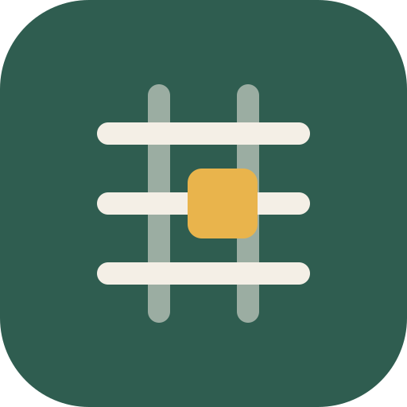
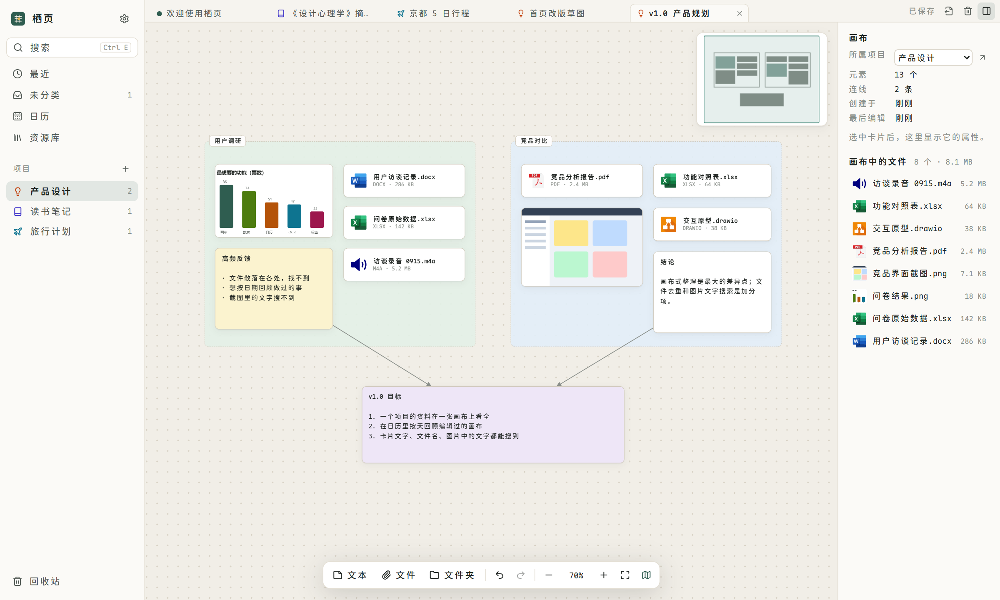
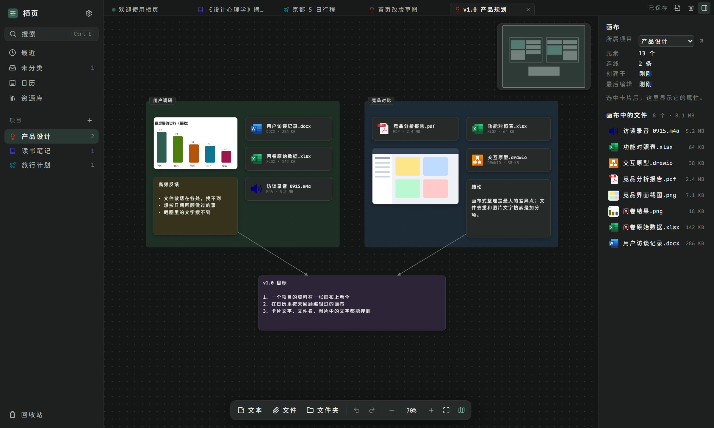
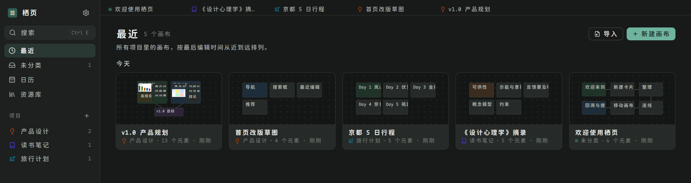

<div align="center">



# 栖页 · Lattira

**把文字、文件和图片摆在一张画布上的个人知识库**

按项目归档，按日期回溯，任何文字都能搜到。

[](https://github.com/DereenMec/Lattira/releases/latest)

[](https://github.com/DereenMec/Lattira/releases)

[**下载**](https://github.com/DereenMec/Lattira/releases/latest) · [功能](#功能) · [常见问题](#常见问题) · [English](#english)

</div>



## 为什么做栖页

做一件事时，资料总是散在各处：Word 和 PDF 在下载文件夹，截图在桌面，想法记在聊天窗口里。过几周再回头，已经想不起当时看过什么、放在哪里。

栖页把这些东西放到同一张画布上：文字是卡片，文件和图片也是卡片。卡片摆在哪里、跟谁放在一起、连向哪里，本身就是整理。所有资料都保存在你电脑上的一个普通文件夹里，不需要账号，也不会上传到任何地方。

## 功能

### 画布

- 无限画布：平移、缩放、框选、多选拖动、小地图，上千张卡片依然流畅
- 文本卡片、文件卡片、图片卡片，卡片之间可以连线，可以着色
- **链接卡片**：粘贴网址即可，自动显示网页标题、简介、预览图和网站图标，双击在浏览器中打开
- 拖动和调整大小时**自动吸附对齐**其他卡片并显示参考线（按住 Alt 暂时关闭），方向键微调位置
- **文件夹**：画布上的一张文件夹卡片，双击打开文件夹窗口查看里面的文件、卡片和子文件夹；把画布上的卡片拖到文件夹卡片或打开的窗口上即可放进去，从窗口里拖到画布上即可取出；从电脑导入整个文件夹时保留原来的子文件夹结构；旧版本画布里的分组框打开时会自动变成文件夹
- 撤销 / 重做、复制粘贴（文件可以直接粘贴到微信、资源管理器）、对齐与等距分布
- **多标签页**：同时打开多个画布，切换时各自的撤销历史都在

### 文件

- 把文件或图片拖进窗口即可导入，会复制一份进工作区；**内容相同的文件只存一份**；导入大文件或大文件夹时右下角显示进度
- 双击用默认程序打开，右键可以在资源管理器中显示、另存为、重命名；同一个文件放在多个画布上时**各画布独立**：在某个画布上打开编辑时自动给它复制一份，改动不会影响其他画布
- 画布或文件夹窗口空白处**右键「新建」**：文本卡片、文件夹、链接，以及与 Windows 右键菜单「新建」相同的文件类型（如 Word、Excel、PowerPoint 文档）
- **资源库**：所有导入过的文件一览，看得到被哪些画布引用、哪些已经没人用，可以多选清理

### 找回

- **全局搜索**（Ctrl+E）：画布名、卡片文字、文件名，以及**图片中的文字**（用 Windows 自带的 OCR 识别），点结果直接跳到那张卡片
- **画布内查找**（Ctrl+F）；搜索结果和卡片上命中的文字都会高亮，从全局搜索跳到画布时自动带上搜索词
- **日历**：每个画布出现在它被编辑过的每一天，回看某天做了什么
- **最近**：所有画布按最后编辑时间排列，带缩略图

### 整理

- 项目：每个项目可以设置图标和颜色，把画布拖到侧栏的项目上即可移动
- **回收站**：删除的画布和文件都能恢复；把画布拖到侧栏的回收站上即可删除
- **导出与导入**：把画布连同引用的文件导出为一个压缩包，也能导入 Obsidian 的 `.canvas` 画布

### 桌面体验

- 浅色、深色、跟随系统三种外观
- 关闭窗口时最小化到托盘，**Ctrl+Shift+L** 随时呼出
- 快捷键都可以自定义
- 左右侧栏可以拖动调整宽度
- 有新版本时在「设置 → 关于」里一键更新
- 中文 / English 界面

<p align="center">
  
  
</p>

## 下载安装

1. 到 [Releases](https://github.com/DereenMec/Lattira/releases/latest) 下载 `Lattira_x.y.z_x64-setup.exe`
2. 运行安装程序。安装包没有代码签名，Windows SmartScreen 提示时点「更多信息」→「仍要运行」
3. 第一次打开时选择一个文件夹作为**工作区**（新建一个空文件夹即可），之后的资料都存在这里

需要 Windows 10 或 11（64 位）。覆盖安装新版本不会影响已有数据；从 0.4.0 起可以在应用内在线更新。

## 常用快捷键

| 操作 | 快捷键 |
| --- | --- |
| 呼出主界面（全局） | Ctrl+Shift+L |
| 全局搜索 | Ctrl+E |
| 画布内查找 | Ctrl+F |
| 新建画布 | Ctrl+N |
| 最近 / 未分类 / 日历 / 资源库 | Ctrl+1 / 2 / 3 / 4 |
| 关闭标签页 / 切换标签页 | Ctrl+W / Ctrl+Tab |
| 新建文本卡片 | T |
| 微调选中的卡片 1 / 10 像素 | 方向键 / Shift+方向键 |
| 拖动时暂时不吸附 | 按住 Alt |
| 放进文件夹 | Ctrl+G |
| 打开 / 重命名选中的文件夹 | Enter / F2 |
| 显示全部内容 | Shift+1 |
| 设置 | Ctrl+, |

画布内的编辑快捷键（T、Ctrl+F、Ctrl+G、Shift+1 等）是固定的，其余都可以在「设置 → 快捷键」里修改。

## 常见问题

**数据存在哪里？**
全部在你选的工作区文件夹里：画布是 `projects/` 下的 `.canvas` 文件，导入的文件在 `assets/` 下，`.lattira/` 里是搜索索引和编辑记录。可以直接用资源管理器浏览，也可以放进网盘同步或备份。

**能和 Obsidian 一起用吗？**
画布文件兼容 [JSON Canvas](https://jsoncanvas.org) 格式，Obsidian 能直接打开；Obsidian 的画布也可以导入栖页，引用的文件会一起复制进来。

**需要联网吗？**
不需要。栖页只在两种情况下联网：检查更新时访问 GitHub（可以在「设置 → 关于」里关掉自动检查）；把网址放到画布上时访问该网页获取标题和预览图（可以在「设置 → 通用 → 链接预览」里关掉）。

**删错了怎么办？**
删除的画布和文件会先进回收站，在侧栏底部的「回收站」里恢复。

## 接下来

- [ ] 文件卡片的内置预览（PDF 等）
- [ ] 超大画布滚动时分批加载卡片

有想法或遇到问题，欢迎提 [Issue](https://github.com/DereenMec/Lattira/issues)。

## 开发

基于 Tauri 2、React 和 Rust。本地开发、代码结构和发布流程见 [开发说明](docs/DEVELOPMENT.md)。

```bash
npm install
npm run tauri dev
```

## 致谢

- 界面字体 [Maple Mono NF CN](https://github.com/subframe7536/maple-font)（OFL-1.1）
- 文件类型图标来自 [vscode-icons](https://github.com/vscode-icons/vscode-icons)（MIT）
- 界面图标 [Lucide](https://lucide.dev)

---

<a id="english"></a>

## English

**Lattira** is a canvas-based personal knowledge base and file manager for Windows. Text, files and images are all cards on an infinite canvas; canvases are organized into projects and can be revisited by date in a calendar view.

- Drag files in — they're copied into your workspace and de-duplicated by content
- Search canvas titles, card text, file names and **text inside images** (Windows OCR)
- Folders on the canvas, links between cards, multiple canvases in tabs
- Paste a URL to get a link card with the page's title, description and preview image
- Cards snap to each other with alignment guides while dragging; arrow keys nudge the selection
- Trash with restore, export / import (compatible with Obsidian's JSON Canvas)
- Light / dark themes, tray icon with a global shortcut (Ctrl+Shift+L), customizable shortcuts, in-app updates
- Everything lives in a plain folder on your computer — no account, no cloud

[Download the latest release](https://github.com/DereenMec/Lattira/releases/latest) · The UI is available in Chinese and English.

<sub>By Dereen</sub>
